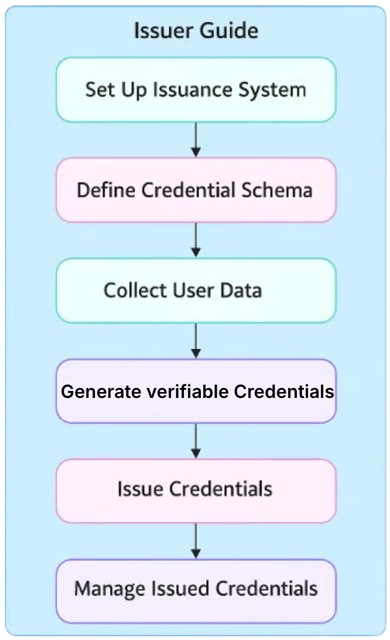

# Issuing Credentials

## Who is an Issuer?

The issuer is the entity responsible for creating and issuing credentials within the AIR Credential ecosystem. It defines Schemas, issues Verifiable Credentials, and manages the lifecycle of credentials.

## How does it work?&#x20;

As an Issuer, you are responsible for issuing **Verifiable Credentials** to users. Follow these steps to integrate and manage the credential issuance process.

<figure><figcaption></figcaption></figure>

### **Step 1: Set Up the Issuance System**

1. **Access the Issuance Widget SDK:**
   1. Download and integrate the **Issuance Widget SDK** into your application environment.
   2. Refer to the SDK documentation to connect it to your backend system.
2. **Define Schema:**
   1. Use the **Dashboard** to define the schema for the credentials you intend to issue.
   2. Specify the attributes to be included (e.g., name, age, nationality, etc.).
   3. Set up schema compliance to ensure compatibility with Verifiable Credential standards.

### **Step 2: Collect User Data**

1. **Determine Data Collection Method**:
   1. **If You Already Have User Data**:
      * Pass the user data to the Issuance Widget SDK as input parameters.
   2. **If You Do Not Have User Data**:
      * **Custom Data Collection**: Integrate your data collection process or connect existing systems to gather user data.
      * **zkTLS Integration**: Use zkTLS to fetch user data from designated sources securely. The encrypted data will be passed to the SDK for processing.

### **Step 3: Generate Verifiable Credentials**

1. **Retrieve Schema**:
   1. The Issuance Widget SDK automatically requests the credential schema from the backend system.
2. **Generate Verifiable Credential**:
   1. Based on the schema and user data, the SDK generates a Verifiable Credential.

### **Step 4: Issue Verifiable Credentials**

1. **On-Chain Issuance**:
   1. Use the Issuance Widget SDK to send a request to the **Issue Node**, completing the on-chain issuance process.
2. **Encrypt and Store Data**:
   1. The SDK encrypts the credential and user data separately.
   2. Encrypted data is stored in the **decentralized storage**.

### **Step 5: Manage Issued Credentials**

1. **Access the Dashboard**:
   1. Use the **Issuer Dashboard** to view and manage issued credentials.
2. **Revoke Credentials (If Needed)**:
   1. In cases where credentials need to be invalidated, use the **Revoke** function in the Dashboard.
