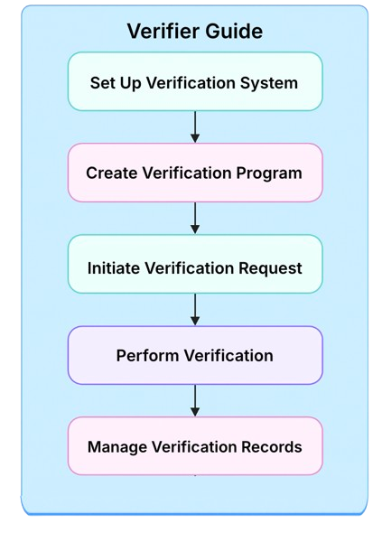

# Verifiable Credentials

## Who is a Verifier?

The **Verifier** is a key entity within the AIR Credential ecosystem, responsible for verifying the authenticity of a user’s credential and determining whether it meets predefined conditions. Leveraging zero-knowledge proofs, the Verifier can validate credentials without accessing or exposing sensitive user data.

## How does it work?&#x20;

As a Verifier, your role is to verify the authenticity of user credentials and ensure they meet the required conditions. Follow these steps to integrate and operate the verification process.

<figure><figcaption></figcaption></figure>

### **Step 1: Set Up the Verification System**

1. **Access the Verifiable Widget SDK**:
   1. Download and integrate the **Verifiable Widget SDK** into your application environment.
   2. Refer to the SDK documentation to connect it to your backend system.
2. **Access the Verifier Dashboard**:
   1. Log in to the **Verifier Dashboard** to configure verification programs.

### **Step 2: Create a Verification Program**

1. **Select Network and Credential Schema**:
   1. In the Dashboard, configure the network.
   2. Specify the schema of the credentials to be verified.
2. **Define Verification Conditions**:
   1. Use the **Define Query** module to set up specific verification conditions, such as:
      * Attributes to verify (e.g., age, nationality).
      * Operators (e.g., Equals, Not Equals, Includes, Excludes).
      * Attribute values to match.
   2. Specify the Issuer’s DID to ensure the credentials being verified originate from a trusted issuer. (if needed)
3. **Review and Save the Program**:
   1. Provide a program name and review all configured details before saving.
4. **Deploy the Program**:
   1. Deploy the verification program to **the Chain**. Once deployed, the program cannot be modified.

### **Step 3: Initiate Verification Requests**

1. **Request Credential Verification**:
   1. Use the Verifiable Widget SDK to send credential verification requests to users.
2. **Fetch Encrypted Credentials**:
   1. The SDK retrieves the user's encrypted credentials from **the Decentralized Storage** using the user’s wallet address and program configuration.
3. **Decrypt Threshold Keys**:
   1. Users approve the decryption process by authorizing the threshold key to the Verifier:
      * The SDK ensures the threshold key is securely signed and encrypted before storing it in **the Decentralized Storage**.

### **Step 4: Perform Verification**

1. **Decrypt Credential and Validate Conditions**:
   1. The SDK uses the user’s private key to decrypt the credential.
   2. Verify the credential’s validity and expiration.
2. **Generate Zero-Knowledge Proof (ZKP)**:
   1. Based on the verification program’s queries, the SDK generates a ZKP.
3. **On-Chain Verification**:
   1. Submit the ZKP to the on-chain **smart contract**.
   2. The smart contract validates the ZKP and returns the verification result.

### **Step 5: Manage Verification Records**

1. **Access Verification Records**:
   1. Use the Verifier Dashboard to view all verification records, including:
      * **Holder ID**
      * **Schema Name**
      * **Program Name and ID**
      * **Verification Time and Status**
      * **Query Details**
2. **Search and Filter Records**:
   1. Search by user identifier or credential ID to locate specific records.

